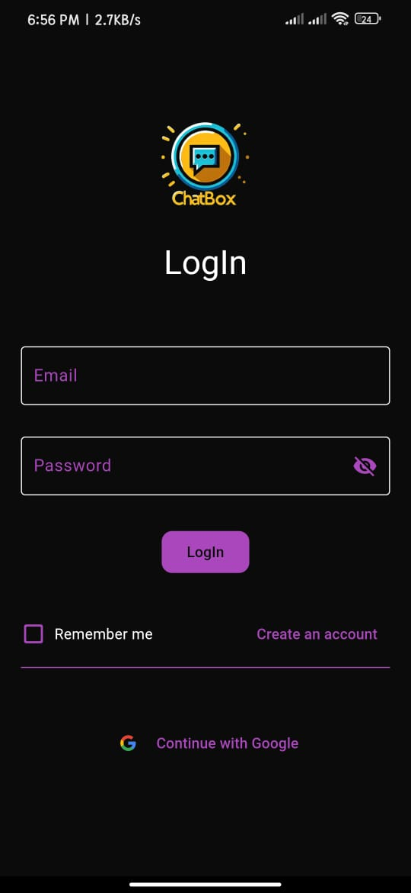
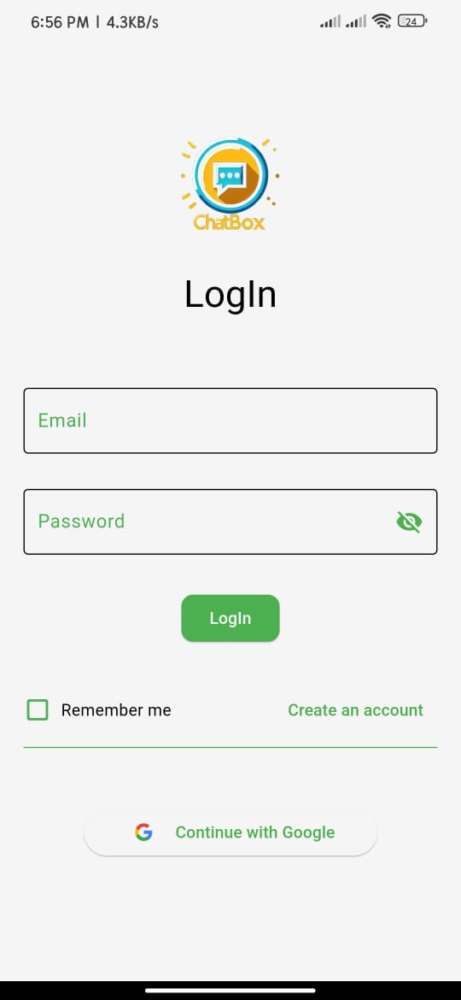
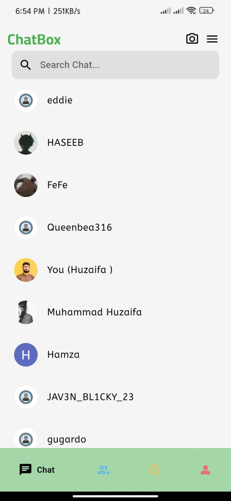
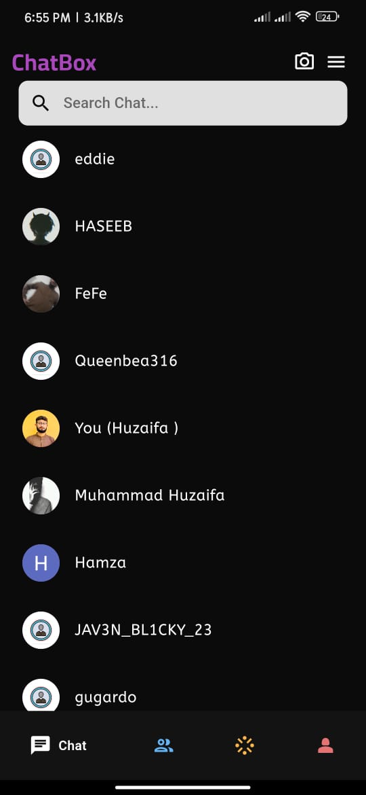
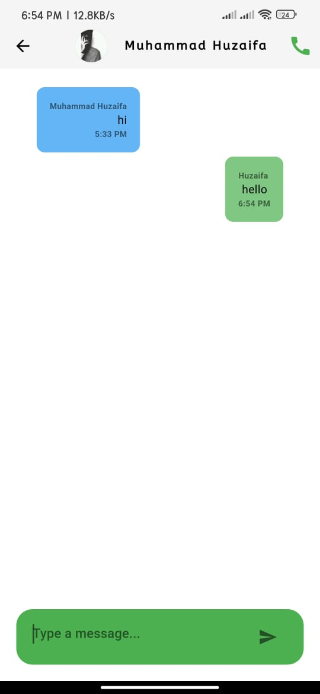
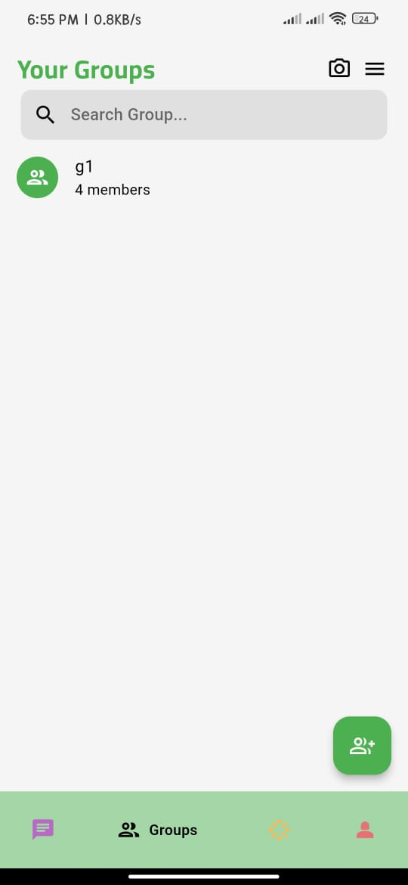
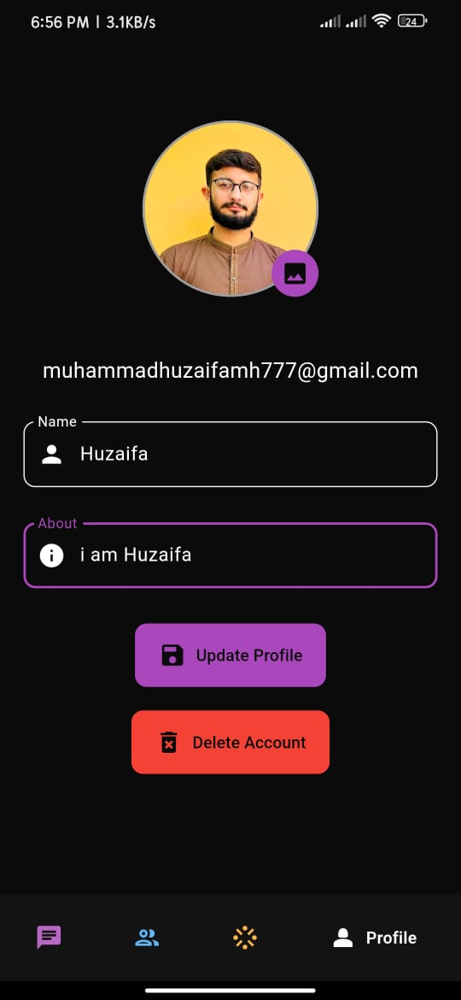

# 💬 ChatBox - Modern Chatting App  

A **Flutter-based real-time messaging app** with **individual & group chats, voice & video calls, and Google Sign-In**. 🚀  
Built using **ZegoCloud** for seamless calling and Firebase for authentication & notifications.  

---

## 📌 Features  

✅ **1-on-1 Chat** – Send and receive messages instantly.  
✅ **Group Chat** – Connect with multiple users in real-time.  
✅ **Voice & Video Calls** – Powered by **ZegoCloud** for high-quality calling.  
✅ **Profile Management** – Update your profile details and picture.  
✅ **Dark & Light Mode** – Toggle between themes for better UI experience.  
✅ **Google Sign-In** – Secure authentication with Google.  
✅ **Push Notifications** – Get real-time chat alerts.  

---

## 🏗️ Tech Stack  

### 🎨 **Frontend**  
- **Flutter (Dart)** – Cross-platform UI framework.  
- **Provider** – State management.  

### 🔥 **Backend & Database**  
- **Firebase Firestore** – Real-time chat storage.  
- **Firebase Authentication** – Google Sign-In & user management.  

### 📞 **Calling & Media**  
- **ZegoCloud SDK** – High-quality voice & video calling.  

---

## 📸 Screenshots  

### 🔑 Sign-in/Sign-up
  <table>
  <tr>
    <td></td>
    <td></td>
  </tr>
</table>

### 🏠 Home Page
<table>
  <tr>
    <td></td>
    <td></td>
  </tr>
</table>

### 💬 Individual Chat


### 💬 Group Chat


### 👤 Profile


---

## 🚀 How to Run  

```bash
don't run. it is not the code but reverse of original apk
